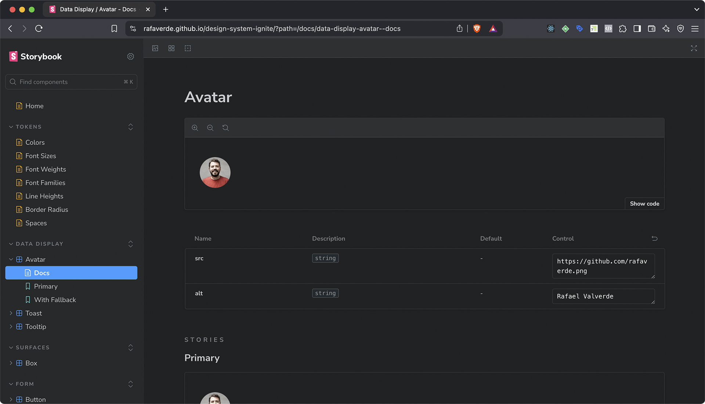

# Design System

Este é um design system criado durante o curso de React.js da Rocketseat. Em breve será lançado oficialmente.

## Componentes

### Data display

- Avatar
- Toast
- Tooltip

### Surfaces

- Box

### Form

- Button
- Checkbox
- Multistep
- Text Area
- Text Input

### Typography

- Heading
- Text

## Licença

Este projeto está licenciado sob a licença MIT.

## Acesse o Projeto

[Design System Ignite](https://rafaverde.github.io/design-system-ignite/)
